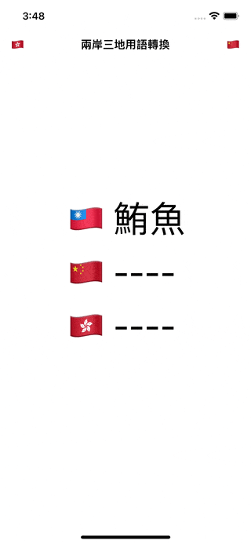

# WWZHConverter

[](https://developer.apple.com/swift/) [](https://developer.apple.com/swift/)  [](https://developer.apple.com/swift/) [](https://developer.apple.com/swift/)

## [Introduction - 簡介](https://swiftpackageindex.com/William-Weng)
- [Convert the words and phrases between the two sides of the Taiwan Strait and the three places into each other.](https://zhconvert.org/)
- [轉換兩岸三地之間的用語。](https://docs.zhconvert.org/)



## [Installation with Swift Package Manager](https://medium.com/彼得潘的-swift-ios-app-開發問題解答集/使用-spm-安裝第三方套件-xcode-11-新功能-2c4ffcf85b4b)
```bash
dependencies: [
    .package(url: "https://github.com/William-Weng/WWZHConverter.git", .upToNextMajor(from: "1.1.3"))
]
```

## 可用函式
|函式|說明|
|-|-|
|serviceInfo(result:)|取得API的相關資訊|
|convertText(_:to:replaces:differents:texts:strategies:result:)|文字轉換 (文字部分)|
|convert(text:to:replaces:differents:texts:strategies:result:)|文字轉換 (完整資訊)|

## Example
```swift
import UIKit
import WWZHConverter

// MARK: - ViewController
final class ViewController: UIViewController {

    @IBOutlet weak var twLabel: UILabel!
    @IBOutlet weak var cnLabel: UILabel!
    @IBOutlet weak var hkLabel: UILabel!
    
    @IBAction func convertToChain(_ sender: UIBarButtonItem) {
        
        convert(text: twLabel.text, type: .China) { text in
            DispatchQueue.main.async { self.cnLabel.text = text }
        }
    }
    
    @IBAction func convertToHK(_ sender: UIBarButtonItem) {
        
        convert(text: twLabel.text, type: .Hongkong) { text in
            DispatchQueue.main.async { self.hkLabel.text = text }
        }
    }
    
    func convert(text: String?, type: WWZHConverter.ConverterType, message: @escaping (String) -> Void) {
        
        guard let text = text else { return }
        
        WWZHConverter.shared.convertText(text, to: type) { result in
            
            switch result {
            case .failure(let error): message("\(error)")
            case .success(let text): message("\(text)")
            }
        }
    }
}
```


